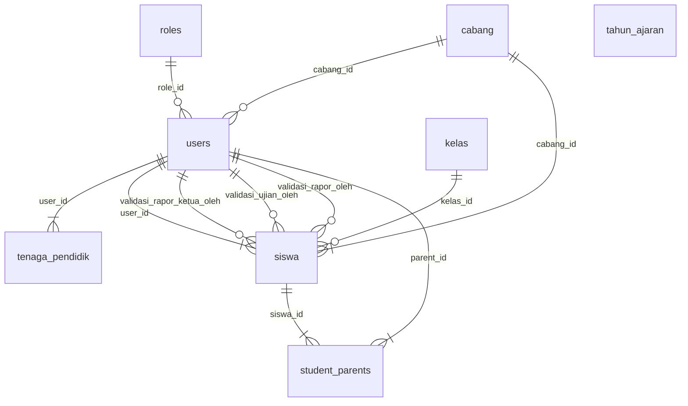
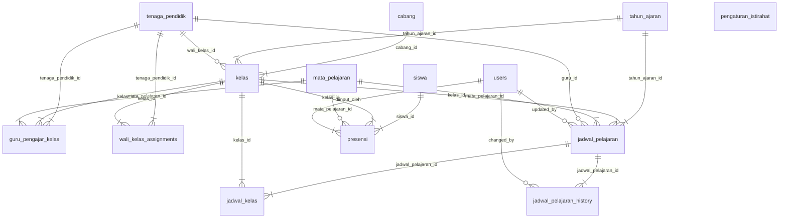
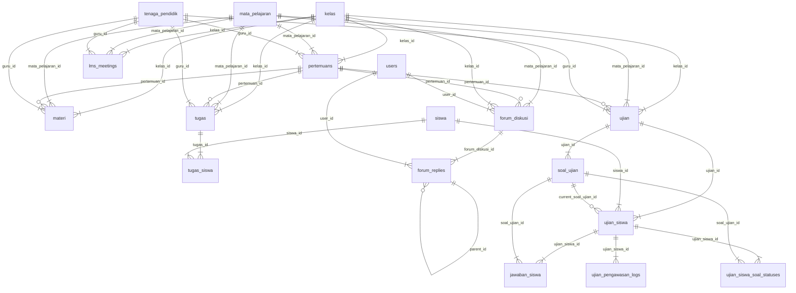
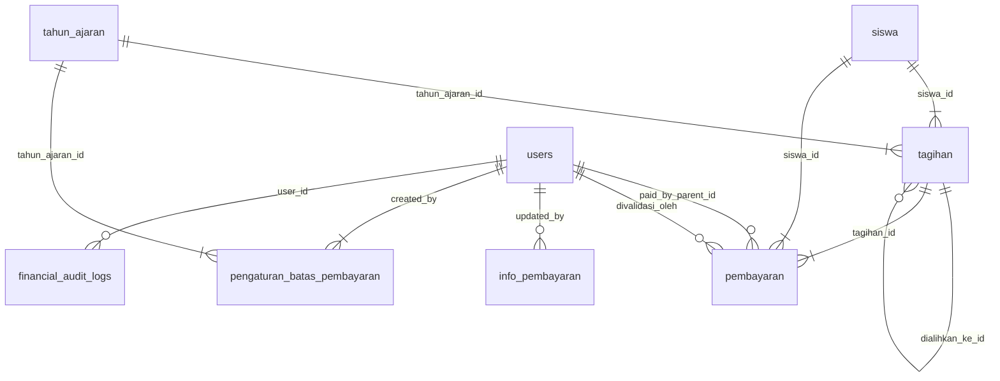
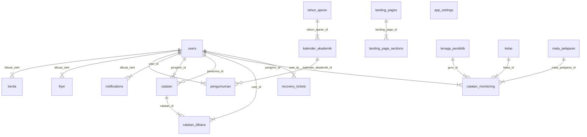

# ENTITY-RELATIONSHIP DIAGRAM (ERD) & TABEL RELASI

> Dokumen ini dibangkitkan langsung dari struktur basis data produksi `db_sipaduhok` (MySQL 8).
> Tabel bawaan framework (cache, sessions, jobs, migrations, dll) dan tabel backup **tidak** disertakan karena bukan entitas bisnis sistem.

*Entity-Relationship Diagram (ERD)* adalah model konseptual yang menggambarkan struktur data dalam sistem: **entitas** (tabel), **atribut** (kolom), dan **hubungan antar entitas** (foreign key). ERD membantu memahami bagaimana data saling terhubung sebelum diimplementasikan ke dalam basis data relasional. Komponennya meliputi entitas kuat & lemah, relasi satu-ke-satu (1:1), satu-ke-banyak (1:N), dan banyak-ke-banyak (M:N), serta atribut kunci (primary key) dan kunci tamu (foreign key).

**Legenda tabel relasi:** kolom bertanda **(PK)** = *Primary Key*, **(FK)** = *Foreign Key*. Kolom "Links to PK" menunjukkan tabel & kolom tujuan yang dirujuk oleh FK tersebut.

---

# BAGIAN 1 — ENTITY-RELATIONSHIP DIAGRAM (ERD)

Karena sistem memiliki lebih dari 50 tabel, ERD disajikan per **subsistem** agar mudah dibaca. Setiap kotak adalah entitas (tabel), garis penghubung adalah relasi foreign key: `||` = satu, `o{`/`|{` = banyak (o = opsional/nullable).

## ERD Subsistem A. Pengguna, Peran & Organisasi

## ERD Subsistem B. Akademik: Kelas, Mapel & Jadwal

## ERD Subsistem C. Penilaian, Rapor & Kenaikan Kelas

```mermaid
erDiagram
  siswa ||--|{ nilai : "siswa_id"
  mata_pelajaran ||--|{ nilai : "mata_pelajaran_id"
  kelas ||--|{ nilai : "kelas_id"
  tahun_ajaran ||--|{ nilai : "tahun_ajaran_id"
  tenaga_pendidik ||--|{ nilai : "guru_id"
  tenaga_pendidik ||--o{ nilai : "edited_by_wali_id"
  tahun_ajaran ||--|{ pengaturan_kkm : "tahun_ajaran_id"
  mata_pelajaran ||--|{ pengaturan_kkm : "mata_pelajaran_id"
  siswa ||--|{ rapor : "siswa_id"
  kelas ||--|{ rapor : "kelas_id"
  tahun_ajaran ||--|{ rapor : "tahun_ajaran_id"
  rapor ||--|{ rapor_nilai : "rapor_id"
  mata_pelajaran ||--|{ rapor_nilai : "mata_pelajaran_id"
  nilai ||--|{ rapor_nilai : "nilai_id"
  rapor ||--|{ rapor_kegiatan_ekstra : "rapor_id"
  mata_pelajaran ||--|{ template_capaian_kompetensi : "mata_pelajaran_id"
  users ||--o{ template_capaian_kompetensi : "created_by"
  siswa ||--|{ pengajuan_rapor_ketua : "siswa_id"
  users ||--|{ pengajuan_rapor_ketua : "diajukan_oleh"
  users ||--o{ pengajuan_rapor_ketua : "diputuskan_oleh"
  rapor ||--|{ request_download_rapor : "rapor_id"
  users ||--|{ request_download_rapor : "user_id"
  siswa ||--|{ request_download_rapor : "siswa_id"
  users ||--o{ request_download_rapor : "diputuskan_oleh"
  siswa ||--|{ status_naik_kelas_siswa : "siswa_id"
  tahun_ajaran ||--|{ status_naik_kelas_siswa : "tahun_ajaran_id"
  kelas ||--o{ status_naik_kelas_siswa : "original_kelas_id"
  users ||--o{ status_naik_kelas_siswa : "rolled_back_by"
  tahun_ajaran ||--|{ promotion_schedules : "tahun_ajaran_id"
  users ||--o{ promotion_schedules : "created_by"
  tahun_ajaran ||--|{ pengaturan_naik_kelas : "tahun_ajaran_id"
  siswa ||--|{ izin_naik_kelas_khusus : "siswa_id"
  tahun_ajaran ||--|{ izin_naik_kelas_khusus : "tahun_ajaran_id"
  users ||--o{ izin_naik_kelas_khusus : "diajukan_oleh"
  users ||--o{ izin_naik_kelas_khusus : "disetujui_oleh"
```

## ERD Subsistem D. LMS: Pertemuan, Materi, Tugas, Ujian & Forum

## ERD Subsistem E. Keuangan

## ERD Subsistem F. Konten, Notifikasi & Sistem

---

# BAGIAN 2 — TABEL RELASI

Rincian struktur tiap tabel beserta relasinya. Disusun mengikuti pengelompokan subsistem yang sama.

## A. Pengguna, Peran & Organisasi

### Tabel 1. `roles`

| Column | Type | Extra | Links to PK — Table | Links to PK — Column |
|---|---|---|---|---|
| id (PK) | bigint unsigned | auto_increment |  |  |
| name | varchar(255) |  |  |  |
| display_name | varchar(255) |  |  |  |
| level | int |  |  |  |
| description | text | nullable |  |  |
| permissions | json | nullable |  |  |
| created_at | timestamp | nullable |  |  |
| updated_at | timestamp | nullable |  |  |

**Penjelasan:** Master peran pengguna (9 peran) dengan `level` hierarki (1=tertinggi). Menjadi acuan `users.role_id`.

### Tabel 2. `users`

| Column | Type | Extra | Links to PK — Table | Links to PK — Column |
|---|---|---|---|---|
| id (PK) | bigint unsigned | auto_increment |  |  |
| name | varchar(255) |  |  |  |
| username | varchar(255) | nullable |  |  |
| email | varchar(255) |  |  |  |
| personal_email | varchar(255) | nullable |  |  |
| foto_profil | varchar(255) | nullable |  |  |
| phone | varchar(255) | nullable |  |  |
| avatar | varchar(255) | nullable |  |  |
| last_login_at | timestamp | nullable |  |  |
| last_login_ip | varchar(255) | nullable |  |  |
| role | enum('admin','ketua_pkbm','wakil_kepala_sekolah','sekretaris','bendahara','wali_kelas','guru_pengajar','siswa','orang_tua') |  |  |  |
| role_id (FK) | bigint unsigned | nullable | `roles` | id |
| email_verified_at | timestamp | nullable |  |  |
| password | varchar(255) |  |  |  |
| security_question | varchar(255) | nullable |  |  |
| security_answer | varchar(255) | nullable |  |  |
| security_pin | varchar(255) | nullable |  |  |
| password_changed_at | timestamp | nullable |  |  |
| is_active | tinyint(1) |  |  |  |
| remember_token | varchar(100) | nullable |  |  |
| created_at | timestamp | nullable |  |  |
| updated_at | timestamp | nullable |  |  |
| cabang_id (FK) | bigint unsigned | nullable | `cabang` | id |

**Penjelasan:** Tabel induk semua akun (semua peran). Menyimpan kredensial, keamanan (PIN/pertanyaan), status aktif. Dirujuk hampir semua tabel lain.

### Tabel 3. `cabang`

| Column | Type | Extra | Links to PK — Table | Links to PK — Column |
|---|---|---|---|---|
| id (PK) | bigint unsigned | auto_increment |  |  |
| kode_cabang | varchar(10) |  |  |  |
| nama_cabang | varchar(255) |  |  |  |
| alamat | text |  |  |  |
| telepon | varchar(255) | nullable |  |  |
| is_active | tinyint(1) |  |  |  |
| created_at | timestamp | nullable |  |  |
| updated_at | timestamp | nullable |  |  |

**Penjelasan:** Data cabang/lokasi sekolah (multi-cabang). Menjadi scope untuk kelas, siswa, dan user.

### Tabel 4. `tenaga_pendidik`

| Column | Type | Extra | Links to PK — Table | Links to PK — Column |
|---|---|---|---|---|
| id (PK) | bigint unsigned | auto_increment |  |  |
| user_id (FK) | bigint unsigned |  | `users` | id |
| nip | varchar(255) | nullable |  |  |
| nama_lengkap | varchar(255) |  |  |  |
| jenis_kelamin | enum('L','P') |  |  |  |
| tempat_lahir | varchar(255) | nullable |  |  |
| tanggal_lahir | date | nullable |  |  |
| alamat | text | nullable |  |  |
| telepon | varchar(255) | nullable |  |  |
| email | varchar(255) | nullable |  |  |
| pendidikan_terakhir | varchar(255) | nullable |  |  |
| foto | varchar(255) | nullable |  |  |
| created_at | timestamp | nullable |  |  |
| updated_at | timestamp | nullable |  |  |

**Penjelasan:** Profil guru/pegawai (1:1 dengan users). Dipakai sebagai guru pengajar, wali kelas, dan pembuat konten LMS.

### Tabel 5. `siswa`

| Column | Type | Extra | Links to PK — Table | Links to PK — Column |
|---|---|---|---|---|
| id (PK) | bigint unsigned | auto_increment |  |  |
| user_id (FK) | bigint unsigned |  | `users` | id |
| cabang_id (FK) | bigint unsigned |  | `cabang` | id |
| kelas_id (FK) | bigint unsigned | nullable | `kelas` | id |
| nisn | varchar(255) |  |  |  |
| nis | varchar(255) | nullable |  |  |
| nama_lengkap | varchar(255) |  |  |  |
| jenis_kelamin | enum('L','P') |  |  |  |
| tempat_lahir | varchar(255) |  |  |  |
| tanggal_lahir | date |  |  |  |
| alamat | text |  |  |  |
| agama | varchar(255) | nullable |  |  |
| pelajaran_agama | varchar(255) | nullable |  |  |
| nama_ayah | varchar(255) | nullable |  |  |
| nama_ibu | varchar(255) | nullable |  |  |
| telepon_orangtua | varchar(255) | nullable |  |  |
| foto | varchar(255) | nullable |  |  |
| tanggal_masuk | date |  |  |  |
| status | enum('aktif','lulus','pindah','keluar') |  |  |  |
| validasi_ujian_bendahara | tinyint(1) |  |  |  |
| validasi_ujian_wali | tinyint(1) |  |  |  |
| tanggal_validasi_ujian_bendahara | timestamp | nullable |  |  |
| tanggal_validasi_ujian_wali | timestamp | nullable |  |  |
| validasi_rapor_bendahara | tinyint(1) |  |  |  |
| validasi_rapor_wali | tinyint(1) |  |  |  |
| validasi_rapor_ketua | tinyint(1) |  |  |  |
| tanggal_validasi_rapor_ketua | timestamp | nullable |  |  |
| validasi_rapor_ketua_oleh (FK) | bigint unsigned | nullable | `users` | id |
| tanggal_validasi_rapor_bendahara | timestamp | nullable |  |  |
| tanggal_validasi_rapor_wali | timestamp | nullable |  |  |
| created_at | timestamp | nullable |  |  |
| updated_at | timestamp | nullable |  |  |
| validasi_ujian_oleh (FK) | bigint unsigned | nullable | `users` | id |
| validasi_rapor_oleh (FK) | bigint unsigned | nullable | `users` | id |

**Penjelasan:** Profil siswa (1:1 dengan users) beserta flag validasi akses ujian & rapor (bendahara/wali/ketua).

### Tabel 6. `student_parents`

| Column | Type | Extra | Links to PK — Table | Links to PK — Column |
|---|---|---|---|---|
| id (PK) | bigint unsigned | auto_increment |  |  |
| siswa_id (FK) | bigint unsigned |  | `siswa` | id |
| parent_id (FK) | bigint unsigned |  | `users` | id |
| relationship | varchar(100) |  |  |  |
| is_primary | tinyint(1) |  |  |  |
| is_financial_responsible | tinyint(1) |  |  |  |
| can_access_academic | tinyint(1) |  |  |  |
| created_at | timestamp | nullable |  |  |
| updated_at | timestamp | nullable |  |  |

**Penjelasan:** Tabel penghubung M:N wali↔siswa. Menandai penanggung jawab utama, penanggung keuangan, dan hak akses akademik.

### Tabel 7. `tahun_ajaran`

| Column | Type | Extra | Links to PK — Table | Links to PK — Column |
|---|---|---|---|---|
| id (PK) | bigint unsigned | auto_increment |  |  |
| nama_tahun_ajaran | varchar(255) |  |  |  |
| tanggal_mulai | date |  |  |  |
| tanggal_selesai | date |  |  |  |
| tanggal_mulai_genap | date | nullable |  |  |
| tanggal_akhir_pts_ganjil | date | nullable |  |  |
| tanggal_akhir_pts_genap | date | nullable |  |  |
| is_active | tinyint(1) |  |  |  |
| created_at | timestamp | nullable |  |  |
| updated_at | timestamp | nullable |  |  |

**Penjelasan:** Master tahun ajaran; hanya satu yang aktif. Menjadi scope mayoritas data akademik & keuangan.

## B. Akademik: Kelas, Mapel & Jadwal

### Tabel 8. `mata_pelajaran`

| Column | Type | Extra | Links to PK — Table | Links to PK — Column |
|---|---|---|---|---|
| id (PK) | bigint unsigned | auto_increment |  |  |
| kode_mapel | varchar(255) |  |  |  |
| nama_mapel | varchar(255) |  |  |  |
| jenjang | enum('KB','TKA','TKB','SD','SMP','SMA') |  |  |  |
| kelompok | enum('A','B') | nullable |  |  |
| deskripsi | text | nullable |  |  |
| is_active | tinyint(1) |  |  |  |
| created_at | timestamp | nullable |  |  |
| updated_at | timestamp | nullable |  |  |

**Penjelasan:** Master mata pelajaran per jenjang (KB–SMA) dan kelompok A/B.

### Tabel 9. `kelas`

| Column | Type | Extra | Links to PK — Table | Links to PK — Column |
|---|---|---|---|---|
| id (PK) | bigint unsigned | auto_increment |  |  |
| cabang_id (FK) | bigint unsigned |  | `cabang` | id |
| tahun_ajaran_id (FK) | bigint unsigned |  | `tahun_ajaran` | id |
| wali_kelas_id (FK) | bigint unsigned | nullable | `tenaga_pendidik` | id |
| nama_kelas | varchar(255) |  |  |  |
| jenjang | enum('KB','TKA','TKB','SD','SMP','SMA') |  |  |  |
| kode_kelas | varchar(255) |  |  |  |
| kuota_siswa | int |  |  |  |
| created_at | timestamp | nullable |  |  |
| updated_at | timestamp | nullable |  |  |

**Penjelasan:** Rombongan belajar per tahun ajaran & cabang, memiliki wali kelas.

### Tabel 10. `guru_pengajar_kelas`

| Column | Type | Extra | Links to PK — Table | Links to PK — Column |
|---|---|---|---|---|
| id (PK) | bigint unsigned | auto_increment |  |  |
| tenaga_pendidik_id (FK) | bigint unsigned |  | `tenaga_pendidik` | id |
| kelas_id (FK) | bigint unsigned |  | `kelas` | id |
| mata_pelajaran_id (FK) | bigint unsigned |  | `mata_pelajaran` | id |
| created_at | timestamp | nullable |  |  |
| updated_at | timestamp | nullable |  |  |

**Penjelasan:** Penugasan guru mengajar mapel tertentu di kelas tertentu (M:N guru–kelas–mapel).

### Tabel 11. `wali_kelas_assignments`

| Column | Type | Extra | Links to PK — Table | Links to PK — Column |
|---|---|---|---|---|
| id (PK) | bigint unsigned | auto_increment |  |  |
| tenaga_pendidik_id (FK) | bigint unsigned |  | `tenaga_pendidik` | id |
| kelas_id (FK) | bigint unsigned |  | `kelas` | id |
| assigned_at | timestamp | DEFAULT_GENERATED |  |  |
| created_at | timestamp | nullable |  |  |
| updated_at | timestamp | nullable |  |  |

**Penjelasan:** Penugasan wali kelas (guru↔kelas), unik per pasangan.

### Tabel 12. `jadwal_pelajaran`

| Column | Type | Extra | Links to PK — Table | Links to PK — Column |
|---|---|---|---|---|
| id (PK) | bigint unsigned | auto_increment |  |  |
| tahun_ajaran_id (FK) | bigint unsigned |  | `tahun_ajaran` | id |
| kelas_id (FK) | bigint unsigned |  | `kelas` | id |
| mata_pelajaran_id (FK) | bigint unsigned |  | `mata_pelajaran` | id |
| guru_id (FK) | bigint unsigned | nullable | `tenaga_pendidik` | id |
| hari | enum('Senin','Selasa','Rabu','Kamis','Jumat','Sabtu') |  |  |  |
| jam_mulai | time |  |  |  |
| jam_selesai | time |  |  |  |
| status | enum('aktif','kosong','diganti') |  |  |  |
| siswa_ids | json | nullable |  |  |
| keterangan | text | nullable |  |  |
| updated_by (FK) | bigint unsigned | nullable | `users` | id |
| created_at | timestamp | nullable |  |  |
| updated_at | timestamp | nullable |  |  |

**Penjelasan:** Jadwal mengajar: mapel + guru + kelas pada hari & jam tertentu dalam satu tahun ajaran.

### Tabel 13. `jadwal_pelajaran_history`

| Column | Type | Extra | Links to PK — Table | Links to PK — Column |
|---|---|---|---|---|
| id (PK) | bigint unsigned | auto_increment |  |  |
| jadwal_pelajaran_id (FK) | bigint unsigned |  | `jadwal_pelajaran` | id |
| field_changed | varchar(255) |  |  |  |
| old_value | text | nullable |  |  |
| new_value | text | nullable |  |  |
| keterangan | text | nullable |  |  |
| changed_by (FK) | bigint unsigned | nullable | `users` | id |
| changed_at | timestamp |  |  |  |
| created_at | timestamp | nullable |  |  |
| updated_at | timestamp | nullable |  |  |

**Penjelasan:** Riwayat perubahan jadwal (audit trail: field, nilai lama/baru, alasan, oleh siapa).

### Tabel 14. `jadwal_kelas`

| Column | Type | Extra | Links to PK — Table | Links to PK — Column |
|---|---|---|---|---|
| id (PK) | bigint unsigned | auto_increment |  |  |
| jadwal_pelajaran_id (FK) | bigint unsigned |  | `jadwal_pelajaran` | id |
| kelas_id (FK) | bigint unsigned |  | `kelas` | id |
| created_at | timestamp | nullable |  |  |
| updated_at | timestamp | nullable |  |  |

**Penjelasan:** Tabel penghubung jadwal↔kelas untuk jadwal multi-kelas/gabungan.

### Tabel 15. `pengaturan_istirahat`

| Column | Type | Extra | Links to PK — Table | Links to PK — Column |
|---|---|---|---|---|
| id (PK) | bigint unsigned | auto_increment |  |  |
| jenjang | enum('KB','TKA','TKB','SD','SMP','SMA') |  |  |  |
| urutan | int |  |  |  |
| jam_mulai | time |  |  |  |
| jam_selesai | time |  |  |  |
| hari_aktif | json |  |  |  |
| nama_istirahat | varchar(255) |  |  |  |
| is_active | tinyint(1) |  |  |  |
| created_at | timestamp | nullable |  |  |
| updated_at | timestamp | nullable |  |  |

**Penjelasan:** Konfigurasi jam istirahat yang disisipkan pada tampilan jadwal.

### Tabel 16. `presensi`

| Column | Type | Extra | Links to PK — Table | Links to PK — Column |
|---|---|---|---|---|
| id (PK) | bigint unsigned | auto_increment |  |  |
| siswa_id (FK) | bigint unsigned |  | `siswa` | id |
| kelas_id (FK) | bigint unsigned |  | `kelas` | id |
| mata_pelajaran_id (FK) | bigint unsigned | nullable | `mata_pelajaran` | id |
| tanggal | date |  |  |  |
| status | enum('hadir','sakit','izin','alpha') |  |  |  |
| status_validasi | enum('pending','disetujui','ditolak') | nullable |  |  |
| keterangan | text | nullable |  |  |
| bukti_file | varchar(255) | nullable |  |  |
| diinput_oleh (FK) | bigint unsigned |  | `users` | id |
| created_at | timestamp | nullable |  |  |
| updated_at | timestamp | nullable |  |  |

**Penjelasan:** Rekap kehadiran siswa per mapel/kelas per tanggal, diinput oleh guru.

## C. Penilaian, Rapor & Kenaikan Kelas

### Tabel 17. `nilai`

| Column | Type | Extra | Links to PK — Table | Links to PK — Column |
|---|---|---|---|---|
| id (PK) | bigint unsigned | auto_increment |  |  |
| siswa_id (FK) | bigint unsigned |  | `siswa` | id |
| mata_pelajaran_id (FK) | bigint unsigned |  | `mata_pelajaran` | id |
| kelas_id (FK) | bigint unsigned |  | `kelas` | id |
| tahun_ajaran_id (FK) | bigint unsigned |  | `tahun_ajaran` | id |
| semester | enum('ganjil','genap') |  |  |  |
| guru_id (FK) | bigint unsigned |  | `tenaga_pendidik` | id |
| tugas_1 | decimal(5,2) | nullable |  |  |
| tugas_2 | decimal(5,2) | nullable |  |  |
| tugas_3 | decimal(5,2) | nullable |  |  |
| tugas_4 | decimal(5,2) | nullable |  |  |
| tugas_5 | decimal(5,2) | nullable |  |  |
| rata_tugas | decimal(5,2) | nullable |  |  |
| latihan_1 | decimal(5,2) | nullable |  |  |
| latihan_2 | decimal(5,2) | nullable |  |  |
| latihan_3 | decimal(5,2) | nullable |  |  |
| latihan_4 | decimal(5,2) | nullable |  |  |
| latihan_5 | decimal(5,2) | nullable |  |  |
| rata_latihan | decimal(5,2) | nullable |  |  |
| uh_1 | decimal(5,2) | nullable |  |  |
| uh_2 | decimal(5,2) | nullable |  |  |
| uh_3 | decimal(5,2) | nullable |  |  |
| uh_4 | decimal(5,2) | nullable |  |  |
| uh_5 | decimal(5,2) | nullable |  |  |
| rata_uh | decimal(5,2) | nullable |  |  |
| pts | decimal(5,2) | nullable |  |  |
| pas | decimal(5,2) | nullable |  |  |
| nilai_akhir | decimal(5,2) | nullable |  |  |
| keterampilan | decimal(5,2) | nullable |  |  |
| to_1 | decimal(5,2) | nullable |  |  |
| to_2 | decimal(5,2) | nullable |  |  |
| to_3 | decimal(5,2) | nullable |  |  |
| upk | decimal(5,2) | nullable |  |  |
| ujian_praktek | decimal(5,2) | nullable |  |  |
| tugas_5_guru | decimal(5,2) | nullable |  |  |
| latihan_5_guru | decimal(5,2) | nullable |  |  |
| uh_5_guru | decimal(5,2) | nullable |  |  |
| tugas_4_guru | decimal(5,2) | nullable |  |  |
| latihan_4_guru | decimal(5,2) | nullable |  |  |
| uh_4_guru | decimal(5,2) | nullable |  |  |
| tugas_3_guru | decimal(5,2) | nullable |  |  |
| latihan_3_guru | decimal(5,2) | nullable |  |  |
| uh_3_guru | decimal(5,2) | nullable |  |  |
| tugas_2_guru | decimal(5,2) | nullable |  |  |
| latihan_2_guru | decimal(5,2) | nullable |  |  |
| uh_2_guru | decimal(5,2) | nullable |  |  |
| tugas_1_guru | decimal(5,2) | nullable |  |  |
| latihan_1_guru | decimal(5,2) | nullable |  |  |
| uh_1_guru | decimal(5,2) | nullable |  |  |
| created_at | timestamp | nullable |  |  |
| updated_at | timestamp | nullable |  |  |
| pts_guru | decimal(5,2) | nullable |  |  |
| pas_guru | decimal(5,2) | nullable |  |  |
| keterampilan_guru | decimal(5,2) | nullable |  |  |
| to_1_guru | decimal(5,2) | nullable |  |  |
| to_2_guru | decimal(5,2) | nullable |  |  |
| to_3_guru | decimal(5,2) | nullable |  |  |
| upk_guru | decimal(5,2) | nullable |  |  |
| ujian_praktek_guru | decimal(5,2) | nullable |  |  |
| guru_terakhir_simpan_at | timestamp | nullable |  |  |
| wali_terakhir_edit_at | timestamp | nullable |  |  |
| edited_by_wali_id (FK) | bigint unsigned | nullable | `tenaga_pendidik` | id |

**Penjelasan:** Nilai siswa per mapel per tahun ajaran (input guru, dapat diedit wali kelas dengan jejak editor).

### Tabel 18. `pengaturan_kkm`

| Column | Type | Extra | Links to PK — Table | Links to PK — Column |
|---|---|---|---|---|
| id (PK) | bigint unsigned | auto_increment |  |  |
| tahun_ajaran_id (FK) | bigint unsigned |  | `tahun_ajaran` | id |
| jenjang | enum('PAUD','SD','SMP','SMA') |  |  |  |
| mata_pelajaran_id (FK) | bigint unsigned |  | `mata_pelajaran` | id |
| nilai_kkm | int |  |  |  |
| created_at | timestamp | nullable |  |  |
| updated_at | timestamp | nullable |  |  |

**Penjelasan:** KKM (Kriteria Ketuntasan Minimal) per mapel per tahun ajaran.

### Tabel 19. `rapor`

| Column | Type | Extra | Links to PK — Table | Links to PK — Column |
|---|---|---|---|---|
| id (PK) | bigint unsigned | auto_increment |  |  |
| siswa_id (FK) | bigint unsigned |  | `siswa` | id |
| kelas_id (FK) | bigint unsigned |  | `kelas` | id |
| tahun_ajaran_id (FK) | bigint unsigned |  | `tahun_ajaran` | id |
| semester | enum('ganjil','genap') |  |  |  |
| jenis_rapor | enum('tengah_semester','akhir_semester') |  |  |  |
| catatan_wali_kelas | text | nullable |  |  |
| catatan_alignment | varchar(12) |  |  |  |
| deskripsi_alignment | varchar(12) |  |  |  |
| keterangan_ekstra_alignment | varchar(12) |  |  |  |
| jumlah_sakit | int |  |  |  |
| jumlah_izin | int |  |  |  |
| jumlah_alpha | int |  |  |  |
| status | enum('draft','diterbitkan') |  |  |  |
| tanggal_terbit | date | nullable |  |  |
| tanggal_rilis | date | nullable |  |  |
| catatan_revisi_ketua | text | nullable |  |  |
| status_review_ketua | enum('pending','perlu_revisi','disetujui') |  |  |  |
| uploaded_pdf_path | varchar(255) | nullable |  |  |
| input_mode | enum('auto_generate','upload_pdf') |  |  |  |
| allow_download | tinyint(1) |  |  |  |
| created_at | timestamp | nullable |  |  |
| updated_at | timestamp | nullable |  |  |

**Penjelasan:** Dokumen rapor siswa per tahun ajaran & kelas beserta status penerbitannya.

### Tabel 20. `rapor_nilai`

| Column | Type | Extra | Links to PK — Table | Links to PK — Column |
|---|---|---|---|---|
| id (PK) | bigint unsigned | auto_increment |  |  |
| rapor_id (FK) | bigint unsigned |  | `rapor` | id |
| mata_pelajaran_id (FK) | bigint unsigned |  | `mata_pelajaran` | id |
| nilai_id (FK) | bigint unsigned |  | `nilai` | id |
| nilai_angka | decimal(5,2) |  |  |  |
| nilai_huruf | varchar(2) |  |  |  |
| deskripsi | text | nullable |  |  |
| urutan | int |  |  |  |
| is_visible | tinyint(1) |  |  |  |
| kelompok_override | varchar(5) | nullable |  |  |
| created_at | timestamp | nullable |  |  |
| updated_at | timestamp | nullable |  |  |

**Penjelasan:** Baris nilai per mapel di dalam sebuah rapor (menautkan rapor ke nilai & mapel).

### Tabel 21. `rapor_kegiatan_ekstra`

| Column | Type | Extra | Links to PK — Table | Links to PK — Column |
|---|---|---|---|---|
| id (PK) | bigint unsigned | auto_increment |  |  |
| rapor_id (FK) | bigint unsigned |  | `rapor` | id |
| kegiatan_nama | varchar(100) |  |  |  |
| predikat | enum('A','B','C') | nullable |  |  |
| keterangan | text | nullable |  |  |
| created_at | timestamp | nullable |  |  |
| updated_at | timestamp | nullable |  |  |

**Penjelasan:** Catatan kegiatan ekstrakurikuler yang tercetak pada rapor.

### Tabel 22. `template_capaian_kompetensi`

| Column | Type | Extra | Links to PK — Table | Links to PK — Column |
|---|---|---|---|---|
| id (PK) | bigint unsigned | auto_increment |  |  |
| mata_pelajaran_id (FK) | bigint unsigned |  | `mata_pelajaran` | id |
| template_text | text |  |  |  |
| created_by (FK) | bigint unsigned | nullable | `users` | id |
| created_at | timestamp | nullable |  |  |
| updated_at | timestamp | nullable |  |  |

**Penjelasan:** Template kalimat capaian kompetensi per mapel untuk mengisi deskripsi rapor.

### Tabel 23. `pengajuan_rapor_ketua`

| Column | Type | Extra | Links to PK — Table | Links to PK — Column |
|---|---|---|---|---|
| id (PK) | bigint unsigned | auto_increment |  |  |
| siswa_id (FK) | bigint unsigned |  | `siswa` | id |
| diajukan_oleh (FK) | bigint unsigned |  | `users` | id |
| alasan | text |  |  |  |
| tipe | enum('rapor','ujian') |  |  |  |
| periode | enum('pts_ganjil','pas_ganjil','pts_genap','pas_genap','ujian_akhir') | nullable |  |  |
| status | enum('menunggu','disetujui','ditolak') |  |  |  |
| diputuskan_oleh (FK) | bigint unsigned | nullable | `users` | id |
| catatan_ketua | text | nullable |  |  |
| tanggal_pengajuan | timestamp | DEFAULT_GENERATED |  |  |
| tanggal_keputusan | timestamp | nullable |  |  |
| created_at | timestamp | nullable |  |  |
| updated_at | timestamp | nullable |  |  |

**Penjelasan:** Pengajuan penerbitan rapor yang membutuhkan persetujuan Ketua PKBM.

### Tabel 24. `request_download_rapor`

| Column | Type | Extra | Links to PK — Table | Links to PK — Column |
|---|---|---|---|---|
| id (PK) | bigint unsigned | auto_increment |  |  |
| rapor_id (FK) | bigint unsigned |  | `rapor` | id |
| user_id (FK) | bigint unsigned |  | `users` | id |
| siswa_id (FK) | bigint unsigned |  | `siswa` | id |
| status | enum('menunggu','disetujui','ditolak') |  |  |  |
| alasan | text | nullable |  |  |
| diputuskan_oleh (FK) | bigint unsigned | nullable | `users` | id |
| catatan_admin | text | nullable |  |  |
| tanggal_request | timestamp | nullable |  |  |
| tanggal_keputusan | timestamp | nullable |  |  |
| download_expired_at | timestamp | nullable |  |  |
| download_token | varchar(64) | nullable |  |  |
| created_at | timestamp | nullable |  |  |
| updated_at | timestamp | nullable |  |  |

**Penjelasan:** Permintaan unduh rapor oleh siswa/wali beserta keputusan penyetujuan.

### Tabel 25. `status_naik_kelas_siswa`

| Column | Type | Extra | Links to PK — Table | Links to PK — Column |
|---|---|---|---|---|
| id (PK) | bigint unsigned | auto_increment |  |  |
| siswa_id (FK) | bigint unsigned |  | `siswa` | id |
| tahun_ajaran_id (FK) | bigint unsigned |  | `tahun_ajaran` | id |
| kelas_asal | varchar(255) | nullable |  |  |
| kelas_tujuan | varchar(255) | nullable |  |  |
| original_kelas_id (FK) | bigint unsigned | nullable | `kelas` | id |
| status_pembayaran | enum('LUNAS','BELUM_LUNAS') |  |  |  |
| persentase_nilai_tuntas | decimal(5,2) |  |  |  |
| jumlah_mapel_tuntas | int |  |  |  |
| total_mapel | int |  |  |  |
| status_kelulusan | enum('NAIK_KELAS','LULUS','TIDAK_NAIK_KELAS','NAIK_KELAS_TUNGGAKAN','LULUS_TUNGGAKAN') |  |  |  |
| izin_khusus_ketua | tinyint(1) |  |  |  |
| tanggal_eksekusi | date | nullable |  |  |
| is_processed | tinyint(1) |  |  |  |
| rolled_back_at | timestamp | nullable |  |  |
| rolled_back_by (FK) | bigint unsigned | nullable | `users` | id |
| created_at | timestamp | nullable |  |  |
| updated_at | timestamp | nullable |  |  |

**Penjelasan:** Status kenaikan/tinggal kelas siswa per tahun ajaran, mendukung rollback.

### Tabel 26. `promotion_schedules`

| Column | Type | Extra | Links to PK — Table | Links to PK — Column |
|---|---|---|---|---|
| id (PK) | bigint unsigned | auto_increment |  |  |
| tahun_ajaran_id (FK) | bigint unsigned |  | `tahun_ajaran` | id |
| scheduled_at | datetime |  |  |  |
| status | enum('PENDING','RUNNING','COMPLETED','FAILED','CANCELLED') |  |  |  |
| created_by (FK) | bigint unsigned | nullable | `users` | id |
| executed_at | datetime | nullable |  |  |
| students_processed | int |  |  |  |
| students_promoted | int |  |  |  |
| students_graduated | int |  |  |  |
| students_failed | int |  |  |  |
| execution_log | text | nullable |  |  |
| notify_on_complete | tinyint(1) |  |  |  |
| notification_email | varchar(255) | nullable |  |  |
| created_at | timestamp | nullable |  |  |
| updated_at | timestamp | nullable |  |  |

**Penjelasan:** Jadwal/periode proses kenaikan kelas per tahun ajaran.

### Tabel 27. `pengaturan_naik_kelas`

| Column | Type | Extra | Links to PK — Table | Links to PK — Column |
|---|---|---|---|---|
| id (PK) | bigint unsigned | auto_increment |  |  |
| tahun_ajaran_id (FK) | bigint unsigned |  | `tahun_ajaran` | id |
| tanggal_pengambilan_rapor | date |  |  |  |
| tanggal_eksekusi | date | nullable |  |  |
| persentase_minimal_tuntas | int |  |  |  |
| created_at | timestamp | nullable |  |  |
| updated_at | timestamp | nullable |  |  |

**Penjelasan:** Parameter kriteria kenaikan kelas (mis. nilai/kehadiran) per tahun ajaran.

### Tabel 28. `izin_naik_kelas_khusus`

| Column | Type | Extra | Links to PK — Table | Links to PK — Column |
|---|---|---|---|---|
| id (PK) | bigint unsigned | auto_increment |  |  |
| siswa_id (FK) | bigint unsigned |  | `siswa` | id |
| tahun_ajaran_id (FK) | bigint unsigned |  | `tahun_ajaran` | id |
| diajukan_oleh (FK) | bigint unsigned | nullable | `users` | id |
| tanggal_pengajuan | timestamp | DEFAULT_GENERATED |  |  |
| alasan_pengajuan | text | nullable |  |  |
| total_tunggakan | decimal(15,2) |  |  |  |
| disetujui_oleh (FK) | bigint unsigned | nullable | `users` | id |
| tanggal_persetujuan | timestamp | nullable |  |  |
| status | enum('MENUNGGU','DISETUJUI','DITOLAK') |  |  |  |
| catatan_ketua | text | nullable |  |  |
| created_at | timestamp | nullable |  |  |
| updated_at | timestamp | nullable |  |  |

**Penjelasan:** Dispensasi kenaikan kelas khusus untuk siswa tertentu beserta pengaju & penyetuju.

## D. LMS: Pertemuan, Materi, Tugas, Ujian & Forum

### Tabel 29. `pertemuans`

| Column | Type | Extra | Links to PK — Table | Links to PK — Column |
|---|---|---|---|---|
| id (PK) | bigint unsigned | auto_increment |  |  |
| kelas_id (FK) | bigint unsigned |  | `kelas` | id |
| mata_pelajaran_id (FK) | bigint unsigned |  | `mata_pelajaran` | id |
| guru_id (FK) | bigint unsigned |  | `tenaga_pendidik` | id |
| judul | varchar(255) |  |  |  |
| pekan | int |  |  |  |
| deskripsi | text | nullable |  |  |
| tanggal | date |  |  |  |
| zoom_link | varchar(255) | nullable |  |  |
| created_at | timestamp | nullable |  |  |
| updated_at | timestamp | nullable |  |  |

**Penjelasan:** Pertemuan/pekan pembelajaran LMS per kelas–mapel–guru; menjadi wadah materi, tugas, dan ujian.

### Tabel 30. `materi`

| Column | Type | Extra | Links to PK — Table | Links to PK — Column |
|---|---|---|---|---|
| id (PK) | bigint unsigned | auto_increment |  |  |
| kelas_id (FK) | bigint unsigned |  | `kelas` | id |
| mata_pelajaran_id (FK) | bigint unsigned |  | `mata_pelajaran` | id |
| pertemuan_id (FK) | bigint unsigned | nullable | `pertemuans` | id |
| guru_id (FK) | bigint unsigned |  | `tenaga_pendidik` | id |
| judul_materi | varchar(255) |  |  |  |
| kategori | enum('materi','modul_ajar') |  |  |  |
| deskripsi | text | nullable |  |  |
| file_materi | varchar(255) | nullable |  |  |
| url_materi | varchar(255) | nullable |  |  |
| tipe_file | enum('pdf','video','ppt','doc','link') | nullable |  |  |
| tanggal_upload | date |  |  |  |
| created_at | timestamp | nullable |  |  |
| updated_at | timestamp | nullable |  |  |

**Penjelasan:** Materi/bahan ajar LMS yang diunggah guru pada suatu pertemuan.

### Tabel 31. `tugas`

| Column | Type | Extra | Links to PK — Table | Links to PK — Column |
|---|---|---|---|---|
| id (PK) | bigint unsigned | auto_increment |  |  |
| kelas_id (FK) | bigint unsigned |  | `kelas` | id |
| mata_pelajaran_id (FK) | bigint unsigned |  | `mata_pelajaran` | id |
| pertemuan_id (FK) | bigint unsigned | nullable | `pertemuans` | id |
| guru_id (FK) | bigint unsigned |  | `tenaga_pendidik` | id |
| jenis_tugas | enum('tugas','latihan') |  |  |  |
| urutan | int | nullable |  |  |
| judul_tugas | varchar(255) |  |  |  |
| judul_bab | varchar(255) | nullable |  |  |
| nama_materi | varchar(255) | nullable |  |  |
| deskripsi | text |  |  |  |
| file_tugas | varchar(255) | nullable |  |  |
| tampilkan_nilai | tinyint(1) |  |  |  |
| bisa_diulang | tinyint(1) |  |  |  |
| batas_pengulangan | int | nullable |  |  |
| tanggal_mulai | date |  |  |  |
| tanggal_deadline | date |  |  |  |
| created_at | timestamp | nullable |  |  |
| updated_at | timestamp | nullable |  |  |

**Penjelasan:** Penugasan (assignment) LMS yang dibuat guru.

### Tabel 32. `tugas_siswa`

| Column | Type | Extra | Links to PK — Table | Links to PK — Column |
|---|---|---|---|---|
| id (PK) | bigint unsigned | auto_increment |  |  |
| tugas_id (FK) | bigint unsigned |  | `tugas` | id |
| siswa_id (FK) | bigint unsigned |  | `siswa` | id |
| file_jawaban | varchar(255) | nullable |  |  |
| jawaban_text | text | nullable |  |  |
| tanggal_submit | timestamp | nullable |  |  |
| nilai | decimal(5,2) | nullable |  |  |
| status | enum('belum_dikerjakan','dikerjakan','terlambat','dinilai') |  |  |  |
| pengulangan_ke | int |  |  |  |
| feedback_guru | text | nullable |  |  |
| created_at | timestamp | nullable |  |  |
| updated_at | timestamp | nullable |  |  |

**Penjelasan:** Pengumpulan tugas oleh siswa (M:N tugas↔siswa) beserta nilai.

### Tabel 33. `ujian`

| Column | Type | Extra | Links to PK — Table | Links to PK — Column |
|---|---|---|---|---|
| id (PK) | bigint unsigned | auto_increment |  |  |
| kelas_id (FK) | bigint unsigned |  | `kelas` | id |
| mata_pelajaran_id (FK) | bigint unsigned |  | `mata_pelajaran` | id |
| pertemuan_id (FK) | bigint unsigned | nullable | `pertemuans` | id |
| guru_id (FK) | bigint unsigned |  | `tenaga_pendidik` | id |
| judul_ujian | varchar(255) |  |  |  |
| deskripsi | text | nullable |  |  |
| tipe_ujian | enum('harian','uts','uas','ulangan_harian','kuis','latihan','pts_ganjil','pas_ganjil','pts_genap','pas_genap','to_1','to_2','to_3','upk','ujian_praktek') |  |  |  |
| urutan | int | nullable |  |  |
| tanggal_mulai | datetime |  |  |  |
| tanggal_selesai | datetime |  |  |  |
| durasi_menit | int |  |  |  |
| is_active | tinyint(1) |  |  |  |
| tampilkan_nilai | tinyint(1) |  |  |  |
| bisa_diulang | tinyint(1) |  |  |  |
| batas_pengulangan | int | nullable |  |  |
| tampilkan_riwayat | tinyint(1) |  |  |  |
| created_at | timestamp | nullable |  |  |
| updated_at | timestamp | nullable |  |  |

**Penjelasan:** Bank ujian/kuis LMS per kelas–mapel.

### Tabel 34. `soal_ujian`

| Column | Type | Extra | Links to PK — Table | Links to PK — Column |
|---|---|---|---|---|
| id (PK) | bigint unsigned | auto_increment |  |  |
| ujian_id (FK) | bigint unsigned |  | `ujian` | id |
| narasi | text | nullable |  |  |
| image_path | varchar(255) | nullable |  |  |
| urutan | int | nullable |  |  |
| pertanyaan | text |  |  |  |
| tipe_soal | enum('pilihan_ganda','essay','pilihan_ganda_kompleks','benar_salah','isian_singkat','uraian') |  |  |  |
| jumlah_pilihan | int |  |  |  |
| pilihan_jawaban | json | nullable |  |  |
| jawaban_benar | varchar(255) | nullable |  |  |
| kunci_jawaban | text | nullable |  |  |
| bobot_nilai | int |  |  |  |
| created_at | timestamp | nullable |  |  |
| updated_at | timestamp | nullable |  |  |

**Penjelasan:** Butir soal milik sebuah ujian.

### Tabel 35. `ujian_siswa`

| Column | Type | Extra | Links to PK — Table | Links to PK — Column |
|---|---|---|---|---|
| id (PK) | bigint unsigned | auto_increment |  |  |
| ujian_id (FK) | bigint unsigned |  | `ujian` | id |
| siswa_id (FK) | bigint unsigned |  | `siswa` | id |
| current_soal_ujian_id (FK) | bigint unsigned | nullable | `soal_ujian` | id |
| current_nomor_soal | int unsigned | nullable |  |  |
| waktu_mulai | timestamp | nullable |  |  |
| waktu_selesai | timestamp | nullable |  |  |
| last_activity_at | timestamp | nullable |  |  |
| last_heartbeat_at | timestamp | nullable |  |  |
| nilai | decimal(5,2) | nullable |  |  |
| pengulangan_ke | int |  |  |  |
| nilai_terbaik | decimal(5,2) | nullable |  |  |
| answered_count | int unsigned |  |  |  |
| doubt_count | int unsigned |  |  |  |
| visited_count | int unsigned |  |  |  |
| focus_lost_count | int unsigned |  |  |  |
| focus_lost_total_seconds | int unsigned |  |  |  |
| active_focus_lost_at | timestamp | nullable |  |  |
| status | enum('belum_mulai','sedang_mengerjakan','selesai','dinilai') |  |  |  |
| created_at | timestamp | nullable |  |  |
| updated_at | timestamp | nullable |  |  |

**Penjelasan:** Sesi pengerjaan ujian oleh seorang siswa (status, skor, soal aktif).

### Tabel 36. `jawaban_siswa`

| Column | Type | Extra | Links to PK — Table | Links to PK — Column |
|---|---|---|---|---|
| id (PK) | bigint unsigned | auto_increment |  |  |
| ujian_siswa_id (FK) | bigint unsigned |  | `ujian_siswa` | id |
| soal_ujian_id (FK) | bigint unsigned |  | `soal_ujian` | id |
| jawaban | text |  |  |  |
| nilai_soal | decimal(5,2) | nullable |  |  |
| feedback | text | nullable |  |  |
| created_at | timestamp | nullable |  |  |
| updated_at | timestamp | nullable |  |  |

**Penjelasan:** Jawaban siswa atas tiap soal dalam sesi ujian.

### Tabel 37. `ujian_siswa_soal_statuses`

| Column | Type | Extra | Links to PK — Table | Links to PK — Column |
|---|---|---|---|---|
| id (PK) | bigint unsigned | auto_increment |  |  |
| ujian_siswa_id (FK) | bigint unsigned |  | `ujian_siswa` | id |
| soal_ujian_id (FK) | bigint unsigned |  | `soal_ujian` | id |
| nomor_soal | int unsigned | nullable |  |  |
| is_visited | tinyint(1) |  |  |  |
| is_answered | tinyint(1) |  |  |  |
| is_doubt | tinyint(1) |  |  |  |
| last_visited_at | timestamp | nullable |  |  |
| last_answered_at | timestamp | nullable |  |  |
| last_doubt_at | timestamp | nullable |  |  |
| created_at | timestamp | nullable |  |  |
| updated_at | timestamp | nullable |  |  |

**Penjelasan:** Status per soal dalam sesi ujian (mis. ditandai/ragu-ragu) untuk navigasi.

### Tabel 38. `ujian_pengawasan_logs`

| Column | Type | Extra | Links to PK — Table | Links to PK — Column |
|---|---|---|---|---|
| id (PK) | bigint unsigned | auto_increment |  |  |
| ujian_siswa_id (FK) | bigint unsigned |  | `ujian_siswa` | id |
| event_type | varchar(50) |  |  |  |
| description | varchar(255) | nullable |  |  |
| metadata | json | nullable |  |  |
| ip_address | varchar(45) | nullable |  |  |
| user_agent | text | nullable |  |  |
| occurred_at | timestamp | DEFAULT_GENERATED |  |  |
| created_at | timestamp | nullable |  |  |
| updated_at | timestamp | nullable |  |  |

**Penjelasan:** Log pengawasan/anti-curang selama siswa mengerjakan ujian online.

### Tabel 39. `forum_diskusi`

| Column | Type | Extra | Links to PK — Table | Links to PK — Column |
|---|---|---|---|---|
| id (PK) | bigint unsigned | auto_increment |  |  |
| mata_pelajaran_id (FK) | bigint unsigned |  | `mata_pelajaran` | id |
| pertemuan_id (FK) | bigint unsigned | nullable | `pertemuans` | id |
| kelas_id (FK) | bigint unsigned |  | `kelas` | id |
| user_id (FK) | bigint unsigned |  | `users` | id |
| topik | enum('materi','tugas','ujian','umum') |  |  |  |
| judul | varchar(255) |  |  |  |
| isi | text |  |  |  |
| reference_id | bigint unsigned | nullable |  |  |
| is_pinned | tinyint(1) |  |  |  |
| is_closed | tinyint(1) |  |  |  |
| lampiran | json | nullable |  |  |
| created_at | timestamp | nullable |  |  |
| updated_at | timestamp | nullable |  |  |

**Penjelasan:** Topik diskusi LMS per kelas–mapel (opsional terkait pertemuan/konten).

### Tabel 40. `forum_replies`

| Column | Type | Extra | Links to PK — Table | Links to PK — Column |
|---|---|---|---|---|
| id (PK) | bigint unsigned | auto_increment |  |  |
| forum_diskusi_id (FK) | bigint unsigned |  | `forum_diskusi` | id |
| user_id (FK) | bigint unsigned |  | `users` | id |
| parent_id (FK) | bigint unsigned | nullable | `forum_replies` | id |
| isi | text |  |  |  |
| is_answer | tinyint(1) |  |  |  |
| is_teacher_reply | tinyint(1) |  |  |  |
| attachment | text | nullable |  |  |
| created_at | timestamp | nullable |  |  |
| updated_at | timestamp | nullable |  |  |

**Penjelasan:** Balasan pada forum diskusi, mendukung balasan bertingkat (self-reference).

### Tabel 41. `lms_meetings`

| Column | Type | Extra | Links to PK — Table | Links to PK — Column |
|---|---|---|---|---|
| id (PK) | bigint unsigned | auto_increment |  |  |
| kelas_id (FK) | bigint unsigned |  | `kelas` | id |
| mata_pelajaran_id (FK) | bigint unsigned |  | `mata_pelajaran` | id |
| guru_id (FK) | bigint unsigned |  | `tenaga_pendidik` | id |
| judul | varchar(255) |  |  |  |
| platform | enum('zoom','google_meet','lainnya') |  |  |  |
| link_meeting | text |  |  |  |
| waktu_mulai | datetime |  |  |  |
| waktu_selesai | datetime | nullable |  |  |
| deskripsi | text | nullable |  |  |
| is_active | tinyint(1) |  |  |  |
| created_at | timestamp | nullable |  |  |
| updated_at | timestamp | nullable |  |  |

**Penjelasan:** Jadwal kelas virtual (Zoom/Google Meet) per kelas–mapel oleh guru.

## E. Keuangan

### Tabel 42. `tagihan`

| Column | Type | Extra | Links to PK — Table | Links to PK — Column |
|---|---|---|---|---|
| id (PK) | bigint unsigned | auto_increment |  |  |
| siswa_id (FK) | bigint unsigned |  | `siswa` | id |
| tahun_ajaran_id (FK) | bigint unsigned |  | `tahun_ajaran` | id |
| tagihan_asal_id (FK) | bigint unsigned | nullable | `tagihan` | id |
| dialihkan_ke_id (FK) | bigint unsigned | nullable | `tagihan` | id |
| dialihkan_pada | timestamp | nullable |  |  |
| jenis_tagihan | varchar(255) |  |  |  |
| keterangan | varchar(255) | nullable |  |  |
| jumlah | decimal(10,2) |  |  |  |
| tanggal_jatuh_tempo | date |  |  |  |
| status | enum('belum_bayar','sudah_bayar','terlambat','cicilan') | nullable |  |  |
| created_at | timestamp | nullable |  |  |
| updated_at | timestamp | nullable |  |  |

**Penjelasan:** Tagihan keuangan siswa (SPP, uang pangkal, dll). Mendukung carryover tunggakan antar tahun via `tagihan_asal_id`/`dialihkan_ke_id`.

### Tabel 43. `pembayaran`

| Column | Type | Extra | Links to PK — Table | Links to PK — Column |
|---|---|---|---|---|
| id (PK) | bigint unsigned | auto_increment |  |  |
| tagihan_id (FK) | bigint unsigned |  | `tagihan` | id |
| siswa_id (FK) | bigint unsigned |  | `siswa` | id |
| paid_by_parent_id (FK) | bigint unsigned | nullable | `users` | id |
| kode_pembayaran | varchar(255) |  |  |  |
| jumlah_bayar | decimal(10,2) |  |  |  |
| tanggal_bayar | datetime |  |  |  |
| metode_pembayaran | enum('tunai','transfer','midtrans') |  |  |  |
| payment_gateway | varchar(255) | nullable |  |  |
| transaction_id | varchar(255) | nullable |  |  |
| order_id | varchar(255) | nullable |  |  |
| payment_type | varchar(255) | nullable |  |  |
| gateway_response | json | nullable |  |  |
| bukti_pembayaran | varchar(255) | nullable |  |  |
| status_validasi | enum('pending','disetujui','ditolak') |  |  |  |
| divalidasi_oleh (FK) | bigint unsigned | nullable | `users` | id |
| tanggal_validasi | timestamp | nullable |  |  |
| catatan | text | nullable |  |  |
| created_at | timestamp | nullable |  |  |
| updated_at | timestamp | nullable |  |  |

**Penjelasan:** Transaksi pembayaran atas tagihan (manual/Midtrans) beserta status validasi & validator.

### Tabel 44. `info_pembayaran`

| Column | Type | Extra | Links to PK — Table | Links to PK — Column |
|---|---|---|---|---|
| id (PK) | bigint unsigned | auto_increment |  |  |
| nama_bank | varchar(255) | nullable |  |  |
| rekening_bank | varchar(255) | nullable |  |  |
| atas_nama | varchar(255) | nullable |  |  |
| midtrans_merchant_id | varchar(255) | nullable |  |  |
| midtrans_server_key | text | nullable |  |  |
| midtrans_client_key | text | nullable |  |  |
| midtrans_is_production | tinyint(1) |  |  |  |
| midtrans_enabled | tinyint(1) |  |  |  |
| tunai_lokasi | varchar(255) | nullable |  |  |
| tunai_jam_operasional | varchar(255) | nullable |  |  |
| tunai_deskripsi | text | nullable |  |  |
| updated_by (FK) | bigint unsigned | nullable | `users` | id |
| created_at | timestamp | nullable |  |  |
| updated_at | timestamp | nullable |  |  |

**Penjelasan:** Informasi rekening/metode pembayaran yang ditampilkan ke pengguna.

### Tabel 45. `pengaturan_batas_pembayaran`

| Column | Type | Extra | Links to PK — Table | Links to PK — Column |
|---|---|---|---|---|
| id (PK) | bigint unsigned | auto_increment |  |  |
| tahun_ajaran_id (FK) | bigint unsigned |  | `tahun_ajaran` | id |
| periode | enum('pts_ganjil','pas_ganjil','pts_genap','pas_genap','ujian_akhir') |  |  |  |
| jenis_tagihan_required | json |  |  |  |
| created_by (FK) | bigint unsigned |  | `users` | id |
| created_at | timestamp | nullable |  |  |
| updated_at | timestamp | nullable |  |  |

**Penjelasan:** Konfigurasi batas/tenggat pembayaran per tahun ajaran.

### Tabel 46. `financial_audit_logs`

| Column | Type | Extra | Links to PK — Table | Links to PK — Column |
|---|---|---|---|---|
| id (PK) | bigint unsigned | auto_increment |  |  |
| user_id (FK) | bigint unsigned | nullable | `users` | id |
| action | varchar(255) |  |  |  |
| model_type | varchar(255) |  |  |  |
| model_id | bigint unsigned | nullable |  |  |
| old_values | json | nullable |  |  |
| new_values | json | nullable |  |  |
| ip_address | varchar(255) | nullable |  |  |
| user_agent | text | nullable |  |  |
| description | text | nullable |  |  |
| created_at | timestamp | nullable |  |  |
| updated_at | timestamp | nullable |  |  |

**Penjelasan:** Jejak audit setiap aksi keuangan (create/update/verify) dengan nilai lama/baru & metadata.

## F. Konten, Notifikasi & Sistem

### Tabel 47. `berita`

| Column | Type | Extra | Links to PK — Table | Links to PK — Column |
|---|---|---|---|---|
| id (PK) | bigint unsigned | auto_increment |  |  |
| judul | varchar(255) |  |  |  |
| deskripsi_singkat | text |  |  |  |
| gambar_thumbnail | varchar(255) |  |  |  |
| url_berita | varchar(255) |  |  |  |
| kategori | enum('kegiatan','prestasi','pengumuman','artikel','ujian') |  |  |  |
| tanggal_berita | date |  |  |  |
| is_featured | tinyint(1) |  |  |  |
| urutan_tampil | int |  |  |  |
| status | enum('draft','aktif','arsip') |  |  |  |
| dibuat_oleh (FK) | bigint unsigned |  | `users` | id |
| created_at | timestamp | nullable |  |  |
| updated_at | timestamp | nullable |  |  |

**Penjelasan:** Berita/artikel untuk landing page publik.

### Tabel 48. `flyer`

| Column | Type | Extra | Links to PK — Table | Links to PK — Column |
|---|---|---|---|---|
| id (PK) | bigint unsigned | auto_increment |  |  |
| judul | varchar(255) |  |  |  |
| deskripsi | text | nullable |  |  |
| gambar_flyer | varchar(255) |  |  |  |
| link_url | varchar(255) | nullable |  |  |
| tanggal_mulai | date |  |  |  |
| tanggal_selesai | date |  |  |  |
| target_audience | enum('semua','siswa','guru','wali_kelas','orang_tua') |  |  |  |
| urutan_tampil | int |  |  |  |
| status | enum('draft','aktif','nonaktif') |  |  |  |
| dibuat_oleh (FK) | bigint unsigned |  | `users` | id |
| created_at | timestamp | nullable |  |  |
| updated_at | timestamp | nullable |  |  |

**Penjelasan:** Flyer/poster promosi yang ditampilkan di situs publik.

### Tabel 49. `pengumuman`

| Column | Type | Extra | Links to PK — Table | Links to PK — Column |
|---|---|---|---|---|
| id (PK) | bigint unsigned | auto_increment |  |  |
| kalender_akademik_id (FK) | bigint unsigned | nullable | `kalender_akademik` | id |
| dibuat_oleh (FK) | bigint unsigned |  | `users` | id |
| judul | varchar(255) |  |  |  |
| isi_pengumuman | text |  |  |  |
| tanggal_pengumuman | date |  |  |  |
| prioritas | enum('biasa','penting','mendesak') |  |  |  |
| lampiran_surat | varchar(255) | nullable |  |  |
| is_from_kalender | tinyint(1) |  |  |  |
| status | enum('draft','aktif','arsip') |  |  |  |
| created_at | timestamp | nullable |  |  |
| updated_at | timestamp | nullable |  |  |

**Penjelasan:** Pengumuman internal/publik, dapat terkait kalender akademik.

### Tabel 50. `kalender_akademik`

| Column | Type | Extra | Links to PK — Table | Links to PK — Column |
|---|---|---|---|---|
| id (PK) | bigint unsigned | auto_increment |  |  |
| tahun_ajaran_id (FK) | bigint unsigned |  | `tahun_ajaran` | id |
| nama_kegiatan | varchar(255) |  |  |  |
| tanggal_mulai | date |  |  |  |
| tanggal_selesai | date | nullable |  |  |
| waktu_mulai | time | nullable |  |  |
| waktu_selesai | time | nullable |  |  |
| keterangan | text | nullable |  |  |
| jenis_kegiatan | varchar(100) |  |  |  |
| lampiran_surat | varchar(255) | nullable |  |  |
| status | enum('draft','aktif','selesai') |  |  |  |
| is_hidden_siswa | tinyint(1) |  |  |  |
| created_at | timestamp | nullable |  |  |
| updated_at | timestamp | nullable |  |  |

**Penjelasan:** Agenda/kalender akademik per tahun ajaran.

### Tabel 51. `landing_pages`

| Column | Type | Extra | Links to PK — Table | Links to PK — Column |
|---|---|---|---|---|
| id (PK) | bigint unsigned | auto_increment |  |  |
| slug | varchar(255) |  |  |  |
| title | varchar(255) |  |  |  |
| order | int |  |  |  |
| created_at | timestamp | nullable |  |  |
| updated_at | timestamp | nullable |  |  |

**Penjelasan:** Halaman CMS situs publik.

### Tabel 52. `landing_page_sections`

| Column | Type | Extra | Links to PK — Table | Links to PK — Column |
|---|---|---|---|---|
| id (PK) | bigint unsigned | auto_increment |  |  |
| landing_page_id (FK) | bigint unsigned |  | `landing_pages` | id |
| section_key | varchar(255) |  |  |  |
| type | enum('text','rich_text','image','list') |  |  |  |
| content | json |  |  |  |
| is_visible | tinyint(1) |  |  |  |
| order | int |  |  |  |
| created_at | timestamp | nullable |  |  |
| updated_at | timestamp | nullable |  |  |

**Penjelasan:** Blok/section penyusun sebuah landing page (konten dinamis).

### Tabel 53. `notifications`

| Column | Type | Extra | Links to PK — Table | Links to PK — Column |
|---|---|---|---|---|
| id (PK) | bigint unsigned | auto_increment |  |  |
| user_id (FK) | bigint unsigned |  | `users` | id |
| tipe | varchar(50) |  |  |  |
| judul | varchar(255) |  |  |  |
| pesan | text |  |  |  |
| link | varchar(255) | nullable |  |  |
| data | json | nullable |  |  |
| icon | varchar(255) | nullable |  |  |
| color | varchar(255) | nullable |  |  |
| read_at | timestamp | nullable |  |  |
| created_at | timestamp | nullable |  |  |
| updated_at | timestamp | nullable |  |  |

**Penjelasan:** Notifikasi in-app per pengguna.

### Tabel 54. `catatan`

| Column | Type | Extra | Links to PK — Table | Links to PK — Column |
|---|---|---|---|---|
| id (PK) | bigint unsigned | auto_increment |  |  |
| pengirim_id (FK) | bigint unsigned |  | `users` | id |
| judul | varchar(255) |  |  |  |
| isi_catatan | text |  |  |  |
| tipe_penerima | enum('semua','role','individu') |  |  |  |
| role_penerima | varchar(255) | nullable |  |  |
| penerima_id (FK) | bigint unsigned | nullable | `users` | id |
| prioritas | enum('biasa','penting','mendesak') |  |  |  |
| is_read | tinyint(1) |  |  |  |
| tanggal_kirim | timestamp | DEFAULT_GENERATED |  |  |
| created_at | timestamp | nullable |  |  |
| updated_at | timestamp | nullable |  |  |

**Penjelasan:** Pesan/catatan antar pengguna (pengirim↔penerima).

### Tabel 55. `catatan_dibaca`

| Column | Type | Extra | Links to PK — Table | Links to PK — Column |
|---|---|---|---|---|
| id (PK) | bigint unsigned | auto_increment |  |  |
| catatan_id (FK) | bigint unsigned |  | `catatan` | id |
| user_id (FK) | bigint unsigned |  | `users` | id |
| dibaca_pada | timestamp | DEFAULT_GENERATED |  |  |
| created_at | timestamp | nullable |  |  |
| updated_at | timestamp | nullable |  |  |

**Penjelasan:** Penanda baca catatan per pengguna (M:N catatan↔user).

### Tabel 56. `catatan_monitoring`

| Column | Type | Extra | Links to PK — Table | Links to PK — Column |
|---|---|---|---|---|
| id (PK) | bigint unsigned | auto_increment |  |  |
| pengirim_id (FK) | bigint unsigned |  | `users` | id |
| pengirim_role | varchar(50) |  |  |  |
| guru_id (FK) | bigint unsigned |  | `tenaga_pendidik` | id |
| konten_type | varchar(20) |  |  |  |
| konten_id | bigint unsigned |  |  |  |
| kelas_id (FK) | bigint unsigned |  | `kelas` | id |
| mata_pelajaran_id (FK) | bigint unsigned |  | `mata_pelajaran` | id |
| isi_catatan | text |  |  |  |
| dibaca_pada | timestamp | nullable |  |  |
| created_at | timestamp | nullable |  |  |
| updated_at | timestamp | nullable |  |  |

**Penjelasan:** Catatan monitoring pembelajaran dari pengawas/guru terhadap kelas–mapel.

### Tabel 57. `recovery_tickets`

| Column | Type | Extra | Links to PK — Table | Links to PK — Column |
|---|---|---|---|---|
| id (PK) | bigint unsigned | auto_increment |  |  |
| user_id (FK) | bigint unsigned |  | `users` | id |
| tipe_recovery | enum('lupa_username','lupa_password','lupa_keduanya') |  |  |  |
| status | enum('processing','sent','pending_admin','resolved','rejected','expired','failed') | nullable |  |  |
| token_reset | varchar(255) | nullable |  |  |
| target_phone | varchar(255) | nullable |  |  |
| requested_ip | varchar(255) | nullable |  |  |
| user_agent | varchar(255) | nullable |  |  |
| expires_at | timestamp | nullable |  |  |
| created_at | timestamp | nullable |  |  |
| updated_at | timestamp | nullable |  |  |

**Penjelasan:** Tiket pemulihan akun (lupa email/akses) per pengguna.

### Tabel 58. `app_settings`

| Column | Type | Extra | Links to PK — Table | Links to PK — Column |
|---|---|---|---|---|
| id (PK) | bigint unsigned | auto_increment |  |  |
| key | varchar(255) |  |  |  |
| value | text | nullable |  |  |
| created_at | timestamp | nullable |  |  |
| updated_at | timestamp | nullable |  |  |

**Penjelasan:** Setelan global aplikasi berbasis key-value (mis. gate LMS on/off).
